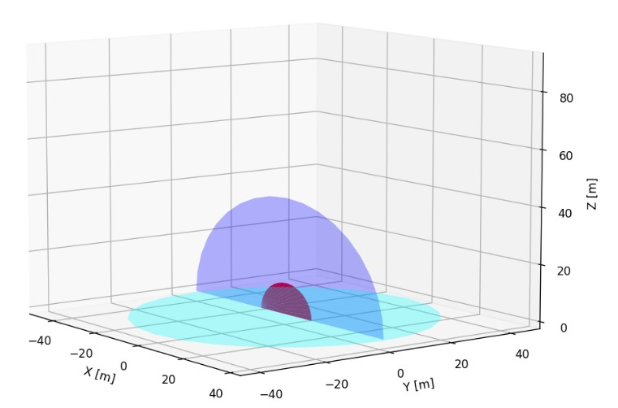
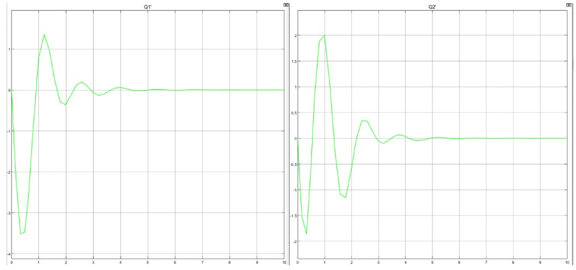
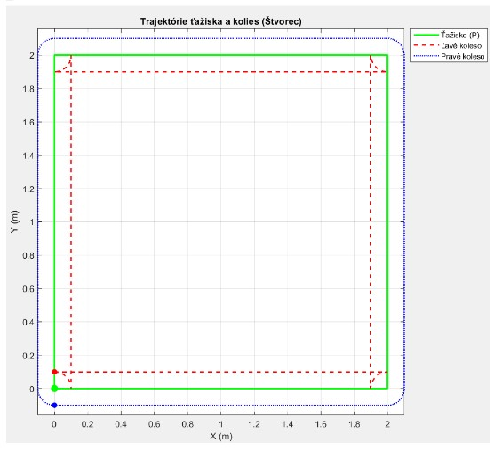

# Robotics_simulations_stu

Portfolio repository of robotics simulations and visualization projects for
STU FEI (MATLAB/Simulink, Python).

Each folder contains:
- source code (Python or MATLAB/Simulink),
- visual outputs (plots/screenshots),
- the submitted PDF report (Slovak).

---

## Projects

### Assignment 01 — Aerial ladder platform (Forward kinematics, Python)
**Folder:** `assignment_01_aerial_ladder_fk_python/`  
**Code:** `DzvonarRobZadanie1.py`  
**Report (SK):** `zad1-Dzvoňár.pdf`

**Summary**
- Computes the world-to-platform transform by chaining 4×4 homogeneous
  transformations (rotations + translations)
- Calculates the platform contact point P in the world frame using:
  - `p0 = T0k * pk` (homogeneous coordinates)
- Visualizes a simplified 3D mechanism and explores workspace reachability

**Key equations**
```text
T0k = T01 · T12 · T23 · ... · T(k-1)k
pk  = [0, 0, 0, 1]^T
p0  = T0k · pk
```

**Preview**


**Run**
```bash
python assignment_01_aerial_ladder_fk_python/DzvonarRobZadanie1.py
```

Dependencies: `numpy`, `matplotlib`.

---

### Assignment 02 — 2-DOF manipulator (Dynamics + PID control, MATLAB/Simulink)
**Folder:** `assignment_02_2dof_manipulator_dynamics_simulink/`  
**Simulink model:** `ROB2_schema_Dzvonar.slx`  
**MATLAB script:** `Script_zad2_Dzvonar.m`  
**Report (SK):** `zad2-Dzvoňár.pdf`

**Summary**
- Dynamic model derived from Lagrange equations and implemented in Simulink
- Verification of correct physics with motors/control disabled (sanity check)
- Joint-level PID position control and response verification
- Velocity/angle plots exported for validation

**Dynamics model**
```text
M(q) q̈ + C(q, q̇) q̇ + G(q) = τ
```

**Verification and control previews**

| Motors/control OFF (sanity check) | Joint velocities during settling | PID setpoint tracking |
|---|---|---|
|  |  |  |

**Run**
1. Open MATLAB in the repository root.
2. Run the init/script to load parameters to workspace:
   - `assignment_02_2dof_manipulator_dynamics_simulink/Script_zad2_Dzvonar.m`
3. Open and run the Simulink model:
   - `assignment_02_2dof_manipulator_dynamics_simulink/ROB2_schema_Dzvonar.slx`

Notes: details (parameters, tests, and reasoning) are in the Slovak PDF report.

---

### Assignment 03 — Differential drive robot (Kinematics + visualization, MATLAB)
**Folder:** `assignment_03_differential_drive_robot_matlab/`  
**Code:** `Rob3U1.m`, `Rob3U2.m`, `Rob3U3.m`, `Rob3U4.m`  
**Report (SK):** `zad3-Dzvonar.pdf`

**Summary**
- Differential drive kinematics simulation and visualization
- Trajectories for robot center and both wheels
- Time plots of wheel velocities and center velocity
- Tasks: arbitrary velocity input, square trajectory, arc–line–arc curve, and interactive control

**Kinematics**
```text
vT = (vR + vL) / 2
wT = (vR - vL) / L
```

**Preview**


**Run**
Open MATLAB in:
`assignment_03_differential_drive_robot_matlab/`

Run scripts (task-based):
- `Rob3U1.m`
- `Rob3U2.m`
- `Rob3U3.m`
- `Rob3U4.m`

---

## Notes on repository hygiene
Generated artifacts (Simulink cache files, Python bytecode, etc.) should not be committed.
This repo uses `.gitignore` to keep only source code + reports + selected figures.

## Author
Imrich Dzvoňár (2025)
